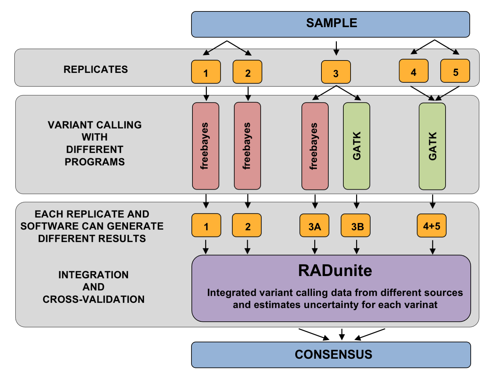

# GapJumper
Flexible pipeline for integration and uncertainty estimation of variant calling data generated from multiple samples, replicates and software results.

##  GAPJUMPER APLICATIONS
* identification of reliable genetic markers in large and heterogenous datasets
* quality evaluation of variants detected in different samples, sample sets or replicates
* evaluation of results obtained with other methods, such as genetic markers selected with large screening studies,
* benchmarking, and SNV calling piepline development,  
* non-regression tests for sequencing and genotyping pielines,  
  
---
## HOW IT WORKS?
GapJumper, is an open source pipeline (GNU License) that allows integration and analysis of variant calling data obtained from multiple replicates, samples and softwares (see figure below). It allows estimation of uncertainty associated with each nucleotide in integrated data, without making assumption on the ploidy or the level of genetic heterogeneity in each sample and replicate. The evidence scores assigned to each nucleotide reflects the error rate, the amount of missing data, and the reproducibility of the results in empirical data only. 

## METHODS IMPLEMENTED
GapJumper uses __vcf files__ generated wiht any variant caller as input (a) and generates similar files in output, with aditional fileds for evidence scores for each nucleotide at each postion (see GapJumper manual). __Four threshold based approaches__ for data integration were implemented in GapJumper, that are commonly used in literature __(b)__. Additonally, we developed and valiadated __two DST-based apraches using semisupervised machine learning algorithsm__ that allow calulating evidence scores for each nucleotide in integrated data __(c)__. DST-based approaches are especially usefull, for large and heteroguenous datasets or datasets with larga amount of missing information that are often found in screening studies using lower coverage sequencing or reduced representaiton sequencing such as RADseq. DST-based approaches can be used independently for data integration or in combinations with any of the of classicial methods (b)
  
Gapjumper pipeline allows for generating consensus with all methods simulatabously (b-c) or to provide evidence scores caulated with any DST-based approaches, while filtering variants using tuned classical methods (b). Additionaly, the Gapjumper allows performing __sample comparisons__ with classicial methods or DST-based appraoch, that also provides __evidence scores (joined probabilities) for individual variants and positons in compared samples or sample sets__ to allow identifying reliable genetic martkers, or to remove potential errors, and low quality positions, without removing relevant infomation on the filtering steps prior to sample comparison.  

## EVALUATION STUDIES ON OPEN ACCESS DATA from Genbank

The performance of GapJumper was evaluated using publically available variant calling data obtained with restriction site associated DNA markers sequencing approach (RAD-seq), that typically generates results with large amount of missing information and variable coverage at different postions. The results demonstrated that GapJumper allows using positions with incomplete or conflicting information in different replicates, and it allows improving the sensitivity of true variant detection. 

### MAIN PROBLEM THE GAPJUMPER IS SOLVING     
  
  Variant calling results generated for the same set of samples or replicates. In the example below, 52k variants were detected in three repliacates with three different varinat calling softwares. Only 32% of variants were found in the results obtained with all three aproaches (a), and many of these varinats, in only one of two replicates (>50%). In case of multisample comparisons, the postions with missing data must be copared and may generate different results depending on the method applied

### SOLUTION    
  GapJumper allows conserving all postions and varinats awith any availabel information for the comparison. instead of removing these postions, it provides evidence scores based on empirical data, calulated with the DST-base approach that allows to select best quality marers, evaluate postions selected with other methods, or to filter potential errors and sequencing artifacts.

### RESULTS AND DISCUSSION   
  Boxplots on Figure b shows evidence scores calulated for variant calling results obtained with three different replicates sequenced and genotyped independently with three different methods (Freebayes and GATK, a). Over 68% of the postions had either missing data or different nucletide compostion, depiste stringent filtering and quality controls, used with each applied method. Thus, to avoid removind these postions, and by that generaitng potential fasle positives by comparing samples with postions having incomplete data, I used DST-based appraoch to generate the consensus, for thae above results. Subsequently, boxplots on Figure b shows the evidence scores of variants that were detected in any combination of replicates and methods used for variant detection, with the most confident variants detected with all positons and replicates (evidence scores ~1). The figure also shows, that some combinations or replicates and approaches may generate better quality variants, but it depends on the postions and its context that is being avlkuaeted wsith my DST-based algorith. For example, higher coverage, or more consistent data, are evaluated with cross-validation step on each postions in each repliate in GapJumper piepline. 

## ADKNOWLEDGMEST   
I thank to dr Frederic Masclaux who helped creatign the first version of the GapJumper in 2016 and helps with its evaluation, and to dr Tania Wyss and Ian Sanders for many usefull comments. 

## LINKS
GapJumepr V01   

